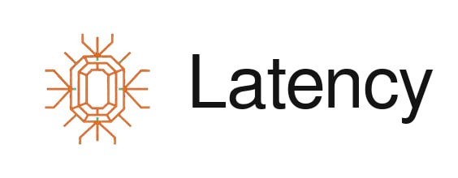

<p align="center">
  
</p>

<h1 align="center">0Latency</h1>
<p align="center"><strong>Persistent Memory Layer for AI Agents</strong></p>

<p align="center">
  <a href="https://pypi.org/project/zerolatency/"></a>
  <a href="https://pypi.org/project/zerolatency/"></a>
  <a href="https://opensource.org/licenses/MIT"></a>
  <a href="https://github.com/jghiglia2380/0Latency/actions"></a>
  <a href="https://0latency.ai"></a>
</p>

---

## What is 0Latency?

0Latency is a **memory layer API** for AI agents. Your agent stores memories from conversations, recalls relevant context in sub-100ms, and never forgets between sessions.

**The problem:** Every AI agent forgets everything when the session ends. Context windows reset. Conversations start from zero. Existing solutions store raw text — they don't understand what matters, what changed, or what your agent needs right now.

**The fix:** 0Latency extracts structured memories automatically, scores them with temporal dynamics, and returns exactly what's relevant — fast.

## Quick Start

```bash
pip install zerolatency
```

```python
from zerolatency import Memory

mem = Memory("zl_live_your_api_key")

# Store — extracted and indexed automatically
mem.add("User prefers Python and hates meetings before 10am")

# Recall — sub-100ms, always
result = mem.recall("Schedule a code review")
# → Python preference, no early meetings. Done.
```

## Features

| Feature | Description |
|---|---|
| **Structured Extraction** | 6 memory types: facts, preferences, decisions, corrections, tasks, relationships |
| **Sub-100ms Recall** | Median 12ms. Composite scoring: semantic similarity + recency + importance + access frequency |
| **Temporal Dynamics** | Memory decay and reinforcement. Stale info fades. Frequently accessed info strengthens |
| **Knowledge Graph** | Entity relationships via Postgres CTEs. Multi-hop traversal. No Neo4j required |
| **Proactive Context** | L0/L1/L2 tiered loading fits your context window budget automatically |
| **Contradiction Detection** | When facts change, old memories get superseded with correction cascading |
| **Negative Recall** | Knows what it doesn't know. No hallucinated context |
| **Async Extraction** | `.add()` returns instantly. Processing happens in background |
| **Webhooks** | HMAC-signed event notifications with retry logic |
| **Org Memory** | Shared memory across team agents. Promote individual → organization level |
| **Chrome Extension** | Auto-captures memories from ChatGPT, Claude, Gemini, Perplexity |
| **Secret Detection** | Inbound content scanned for API keys/tokens — blocked before storage |

## Architecture

```
Conversation → Extraction → Storage → Recall → Agent Context
                  │             │         │
            Gemini Flash   Postgres   Composite
              2.0         + pgvector   Scoring
                                         │
                                 semantic similarity
                                 recency decay
                                 importance weight
                                 access frequency
```

## API Endpoints

| Endpoint | Method | Description |
|---|---|---|
| `/extract` | POST | Extract memories from a conversation turn |
| `/memories/extract` | POST | Async extraction (returns 202, processes in background) |
| `/recall` | POST | Recall relevant memories for a context |
| `/memories` | GET | List memories with pagination and filtering |
| `/memories/{id}` | PUT/DELETE | Update or delete a memory |
| `/memories/search` | GET | Search memories by keyword |
| `/memories/export` | GET | Export all memories (GDPR compliance) |
| `/graph/entity` | GET | Knowledge graph traversal |
| `/graph/entities` | GET | List known entities |
| `/graph/path` | GET | Find shortest path between entities |
| `/webhooks` | POST/GET/DELETE | Manage webhook subscriptions |
| `/health` | GET | Service health check |

Full interactive docs: [api.0latency.ai/docs](https://api.0latency.ai/docs)

## Pricing

| Plan | Price | Memories | Agents |
|---|---|---|---|
| **Free** | $0/mo | 100 | 1 |
| **Pro** | $19/mo | 50,000 | 5 |
| **Scale** | $99/mo | Unlimited | Unlimited |
| **Enterprise** | Custom | Custom | Custom |

## Self-Hosting

0Latency runs on a single Postgres instance with pgvector. No Redis required (used for rate limiting if available). No Neo4j. No Elasticsearch.

```bash
git clone https://github.com/jghiglia2380/0Latency.git
cd 0Latency/memory-product
pip install -r api/requirements.txt
# Set DATABASE_URL, GEMINI_API_KEY
uvicorn api.main:app --host 0.0.0.0 --port 8000
```

## Links

- 🌐 **Website:** [0latency.ai](https://0latency.ai)
- 📖 **API Docs:** [api.0latency.ai/docs](https://api.0latency.ai/docs)
- 📦 **PyPI:** [pypi.org/project/zerolatency](https://pypi.org/project/zerolatency/)
- 🐙 **GitHub:** [github.com/jghiglia2380/0Latency](https://github.com/jghiglia2380/0Latency)
- 🐦 **Twitter:** [@0latencyai](https://twitter.com/0latencyai)

## Build With Us

We're building 0Latency in the open, and we take care of the people who help make it better.

| Contribution | Reward |
|---|---|
| **Report a confirmed bug** | Lifetime Pro access ($29/mo value) |
| **Submit a PR that gets merged** | Lifetime Scale access ($89/mo value) |
| **Build something with 0Latency and share it** (blog, tutorial, OSS project) | Lifetime Scale access ($89/mo value) |

The free tier is generous enough to build real projects — no credit card needed. Start building, and if you find ways to improve 0Latency, we'll take care of you forever.

→ [Report a bug](https://github.com/jghiglia2380/0Latency/issues/new?template=bug_report.md)
→ [View open issues](https://github.com/jghiglia2380/0Latency/issues)
→ [Read the contribution guidelines](CONTRIBUTING.md)

## Contributing

See [CONTRIBUTING.md](CONTRIBUTING.md) for details on how to report bugs, submit PRs, and claim your contributor rewards.

## License

MIT — see [LICENSE](LICENSE) for details.

---

<p align="center">
  <strong>Your agent remembers everything. Zero latency.</strong><br>
  <a href="https://0latency.ai">Get started →</a>
</p>
